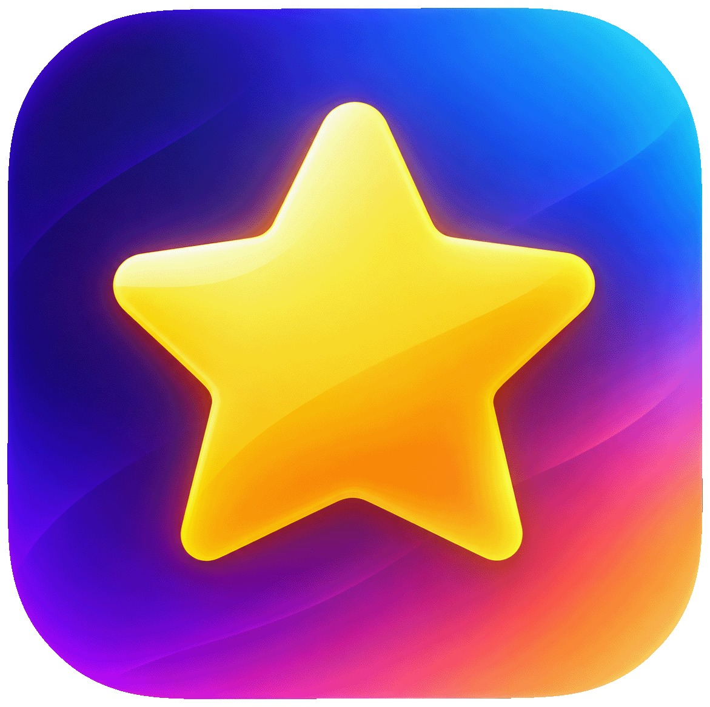
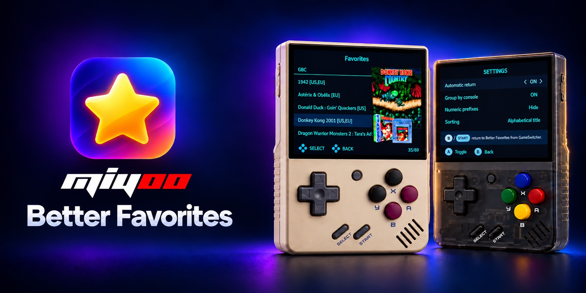
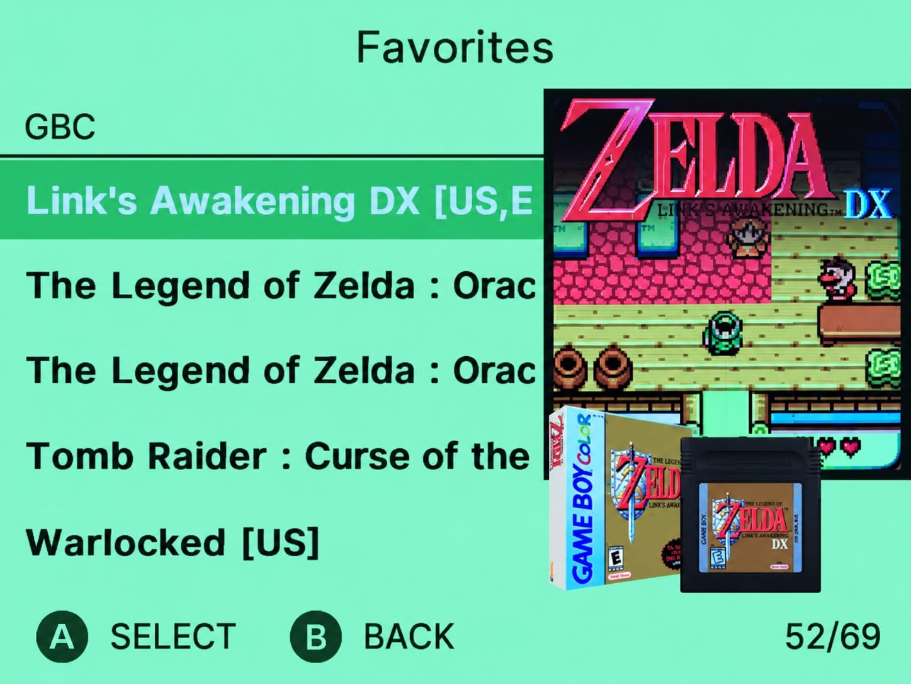
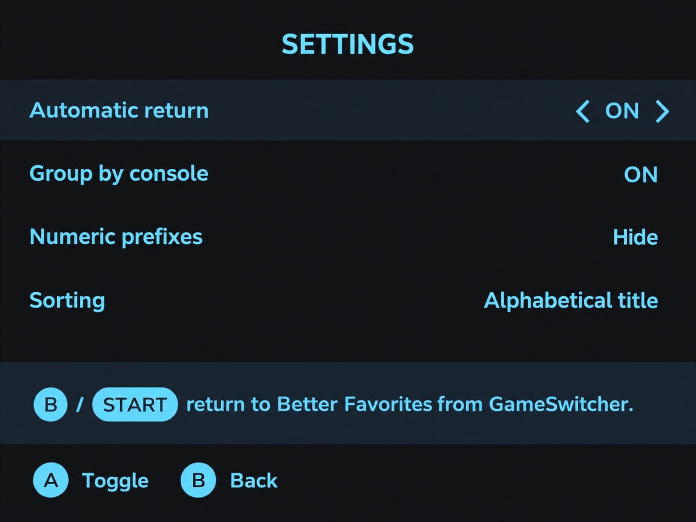

<!-- Logo-->

<div align="center">
  
  <h1>Miyoo Better Favorites</h1>
  <p><em>An alternative Favorites app for Miyoo Mini and Mini Plus running Onion OS.</em></p>
</div>

<!-- Badges-->

<p align="center">
  
  <a href="https://github.com/Architeg/miyoo-better-favorites/releases/tag/v1.0.0-rc.7"></a>
  <a href="docs/compatibility.md"></a>
  <a href="LICENSE"></a>
<a href="https://github.com/Architeg/miyoo-better-favorites/stargazers">
  
</a>
<a href="#support-miyoo-better-favorites">
  
</a>
</p>

<!-- Quick Links-->

<p align="center">
  <a href="#install">Install</a> · <a href="#controls">Controls</a> ·
  <a href="#settings">Settings</a> · <a href="#uninstall">Uninstall</a> ·
  <a href="CONTRIBUTING.md">Contribute</a>
</p>

<!-- Banner-->

<p align="center">
  
</p>

<a id="why-better-favorites"></a>
## Why Better Favorites?

**You saved those games to find them quickly - not to scroll through another crowded unorganized list.**

As your favorites grow, games from different consoles get mixed together. Long names are cut off, numbered titles make browsing awkward, and finding your place again means more scrolling.

Better Favorites turns that list into a browser built around how you use your Miyoo:

- **Find your game without scrolling through a mixed list.** <br>
  Favorites are grouped by system. Jump between consoles with `← / →` and move a page at a time with `L1/R1`. Prefer a single list? Turn grouping off.

- **No more guessing a cut-off title.** <br>
  Long selected titles scroll automatically, so you can tell similar names and versions apart.

- **Cleaner titles, without renaming your games.** <br>
  Hide leading numbers and sort alphabetically by title. Your ROM filenames and saved favorites stay unchanged.

- **Pick up exactly where you left off.** <br>
  Your selection and scroll position are remembered. With Automatic return enabled, `B/START` in GameSwitcher brings you back - even after switching games.

- **Open it just like stock Favorites.** <br>
  Enable Replace stock Favorites once, then open Better Favorites directly from the familiar Home Favorites tile. No detour through Apps.

- **Remove the favorite. Keep the game.**<br>
  Remove an entry with a clear confirmation. Your ROM, artwork, saves and recent history stay untouched.

... and more

**Unlike setting up a separate collection, you start with the favorites you already have.** No rebuilding the list, moving ROMs or maintaining a second library. Better Favorites uses your active Onion theme, while Onion keeps handling launches, cores, saves and GameSwitcher.

> **[Download Better Favorites](https://github.com/Architeg/miyoo-better-favorites/releases/download/v1.0.0-rc.7/better-favorites-1.0.0-rc.7.zip)** — one ZIP for Windows, Mac and Linux. [What’s new →](docs/release/notes-rc.7.md)

<a id="features"></a>
## Features

| Feature | What you get |
| --- | --- |
| Console groups | Browse by system or use a flat list |
| Readable titles | Hide numeric prefixes, choose sorting and scroll long selected titles |
| Theme-aware UI | Active-theme fonts, colors and resources, with missing-resource fallbacks |
| Quick navigation | Console jumps, shoulder paging and remembered selection/scroll |
| GameSwitcher | Open Onion's GameSwitcher directly with MENU |
| Optional Home access | Open the app through the existing Favorites tile |
| Optional return | Return to Better Favorites with B/START after using GameSwitcher |
| Favorite removal | Remove the entry while keeping the game, artwork and saves |

<a id="compatibility"></a>
## Compatibility

**Designed for Mini and Mini Plus; hardware tested on Mini Plus.**

**Device tested:** Miyoo Mini Plus (MY354), firmware `202306282128`, Onion **v4.3.1-1**. MY354 identifies the model/platform. Mini testing is welcome; Flip and other systems are not tested for these integrations.

| Computer | Compatibility |
| --- | --- |
| ❖ Windows | Windows 7 onward; legacy x86/x64 and modern x86/x64/ARM64 builds |
|  macOS | Monterey onward; Intel and Apple Silicon |
| 🐧 Linux | x64 and ARM64; kernel requirements apply |

Scripts select the computer-side executable; every computer installs the **same Miyoo files**. System patches accept only audited Onion files.

[Full compatibility details →](docs/compatibility.md)

<a id="install"></a>
## Install

> [!NOTE]
> **What the installer does:** Installs the app files and applies the supported Home Favorites and Automatic return patches, keeping verified backups of the original system files. Both features start OFF and can be enabled in Settings. Your games, saves, themes and favorites are left untouched. **Complete uninstall** restores the original system files and removes Better Favorites and its own settings and logs.

### • Option 1 - One-click installer · Windows / Mac / Linux

1. Power off the Miyoo and connect its SD card to your computer
2. **[Download the install ZIP](https://github.com/Architeg/miyoo-better-favorites/releases/download/v1.0.0-rc.7/better-favorites-1.0.0-rc.7.zip)** and extract it.
3. Inside the extracted folder, open **App** and copy the **BetterFavorites** folder into the **App** folder on your SD card.
4. Open **App → BetterFavorites** on your SD card and double-click the installer for your computer:

| Computer | File to open |
| --- | --- |
| ❖ Windows | **Install-Windows.cmd** |
|  Mac | **Install-macOS.command** |
| 🐧 Linux | **Install-Linux.desktop** — choose Allow launching if asked |

4. Choose `[1] Install / Update` and confirm the card and powered-off Miyoo.
5. Wait for **Install verified**, safely eject the card, insert it to your Miyoo and boot.

> [!TIP]
> **On Mac, Option 2 below is recommended for a smoother start**, especially if the downloaded files are blocked. It downloads the same package automatically - no copying needed.

#### If Mac asks for approval

For an unsigned-developer warning, choose **Open Anyway** in **System Settings → Privacy & Security**. On Big Sur/Monterey, use **System Preferences → Security & Privacy → General**. The separate **BetterFavorites-Installer** may need approval too; follow the terminal instructions, then choose **R** to retry. Stop for malware or damaged-file warnings. 

Read [Opening help →](docs/security-opening.md) to learn how to troubleshoot installation warnings.

### • Option 2 - One Terminal command · Mac / Linux

1. Power off the Miyoo and connect its SD card to your computer
2. On Mac/Linux open your terminal. Paste:

```bash
curl -fsSL https://raw.githubusercontent.com/Architeg/miyoo-better-favorites/main/scripts/install-online.sh | bash
```

Installer will be dowloaded automatically. Confirm the detected card and choose `[1] Install / Update`. Wait for **Install verified**, safely eject the card, insert it and boot your Miyoo. Intel and Apple Silicon are selected automatically. [Full Terminal guide →](docs/online-install.md)

### After installation

Use the same launcher or Terminal command for `[2] Uninstall completely` or `[3] Export diagnostics`. Deleting the app folder alone does not undo patches.

**Updating?** [Follow the update steps](docs/install.md#update-without-losing-preferences) to keep your settings. GitHub’s **Source code** downloads are for developers, not installation.

<a id="first-launch"></a>
## First launch

<p align="center">
  
  
</p>

Boot your Miyoo. Open **Apps → Better Favorites**, then press `Y` or `Select` for Settings.

- **Replace stock Favorites:** ON opens Better Favorites app from the Home Favorites tile; OFF opens stock Favorites.
- **Automatic return:** ON brings you back to Better Favorites at your previous selection and scroll position when you press `B/START` in GameSwitcher, including after switching games. OFF uses Onion's normal main-menu return.

Both switches default **OFF**, and can be enabled separately in Settings. Automatic return applies when leaving GameSwitcher; Direct game exit ends the automatic-return session, so exiting a game directly returns to Onion’s main menu.

<a id="controls"></a>
## Controls

| Button | In the favorites browser |
| --- | --- |
| ↑ / ↓ | Move selection |
| ← / → | Jump consoles when grouped |
| L1 / R1 | Page up / down; stop at list ends |
| **A** | Launch the selected game |
| **B** | Exit to Onion's main menu |
| **SELECT** | Open actions |
| **Y** | Open Settings |
| **MENU** | Open Onion GameSwitcher |

In menus, `A` activates and `B` goes back or cancels. `MENU` closes menus without opening GameSwitcher. Removal uses `←/→` for Cancel/Remove and `↑/↓` for long-title pages. [Full controls →](docs/user-guide.md)

<a id="settings"></a>
## Other Settings

| Setting | Default | Effect |
| --- | --- | --- |
| Group by console | ON | Console headings/jumps; OFF gives a flat list |
| Numeric prefixes | Show | Show or Hide prefixes. Display only; stored labels remain unchanged |
| Sorting | Original label | Literal-label order or alphabetical title without leading numeric prefixes |
| Replace stock Favorites | OFF | Use the Home tile when its integration is installed |
| Automatic return | OFF | Return from GameSwitcher when its integration is installed |

Preferences save immediately; a failed save retains the previous value. Select a setting to read its description; its About page explains how it works in details.

<a id="remove-a-favorite"></a>
## Remove a favorite

Press `SELECT` → **Remove from Favorites**. Cancel is selected first; choose with `←/→`, confirm with `A`, or cancel with `B`.

**Your game stays on the card.** Only the selected favorites record is removed. ROMs, artwork, saves and recent history remain. A backup is verified first; other records are preserved and conflicting edits are refused. Add favorites through Onion's existing menus.

<a id="update-or-uninstall"></a>
<a id="uninstall"></a>
## Complete uninstall

Power off and connect the card. Open the same computer launcher in **App/BetterFavorites** from SD card and choose `[2] Uninstall completely`.

The tool restores and verifies the original system files, then removes Better Favorites, its preferences, patches, logs and owned installation files. Games, saves, artwork, favorites, recent history, themes and unrelated files remain. A verified copy of recovery is kept on that computer.

Portable recovery is stored separately on the card, so uninstall can run on a different computer. **Deleting the app alone cannot undo the system patches.** Conflicts or missing recovery stop removal with an explanation. [Uninstall and recovery →](docs/uninstall.md)

<a id="troubleshooting-and-diagnostics"></a>
## Help and diagnostics

| Problem | Next step |
| --- | --- |
| Integration unavailable | Check installation and Onion compatibility in About |
| Card path not found | Reconnect the card; in Parallels, attach the SD reader to Windows |
| Installer reports a conflict | Preserve the message and recovery bundle; do not overwrite the unknown file |
| Need help with a bug | Export diagnostics and attach the reviewed ZIP and log files to an issue |

Power off the Miyoo and connect the card. Open the computer launcher inside
**App/BetterFavorites** and choose `[3] Export diagnostics`. It saves a ZIP on
your computer and prints its location. No manually entered command is needed.

Review before sharing: errors may contain game filenames, theme paths and preferences. Detailed tracing is OFF by default. [Diagnostics and privacy →](docs/diagnostics.md)

<a id="support-miyoo-better-favorites"></a>
## ⭐ Support Miyoo Better Favorites

If you enjoy Better Favorites and it makes finding and playing your games easier, you can [share it](https://twitter.com/intent/tweet?url=https%3A%2F%2Fgithub.com%2FArchiteg%2Fmiyoo-better-favorites&text=Miyoo%20Better%20Favorites%20%E2%80%94%20An%20alternative%20Favorites%20app%20for%20Miyoo%20Mini%20and%20Mini%20Plus%20running%20Onion%20OS.), [give it a star](https://github.com/Architeg/miyoo-better-favorites/stargazers), or support its development:

[](https://github.com/sponsors/Architeg)  
[](https://ko-fi.com/architeg)

<a id="contribute-and-learn-more"></a>
## Contribute

Bug reports, feature ideas and device/theme testing are welcome too!

[Report a bug or suggest a feature](https://github.com/Architeg/miyoo-better-favorites/issues/new/choose), share a theme/device test, or log file. You can contribute without writing code.

**[→ How to Contribute](CONTRIBUTING.md)** · [Development](docs/development.md) · [Roadmap](docs/roadmap.md) · [Changelog](CHANGELOG.md)

<a id="credits-and-license"></a>
## Credits and license

🙌 Thanks to [OnionUI](https://github.com/OnionUI/Onion), the [SDL/Miyoo fork contributors](https://github.com/Rparadise-Team/sdl2_miyoo_new), and the upstream library authors.

Project sources are **[GPL-3.0-or-later](LICENSE)**. Dependencies retain their own licenses. [Third-party notices and provenance →](THIRD_PARTY_NOTICES.md)


